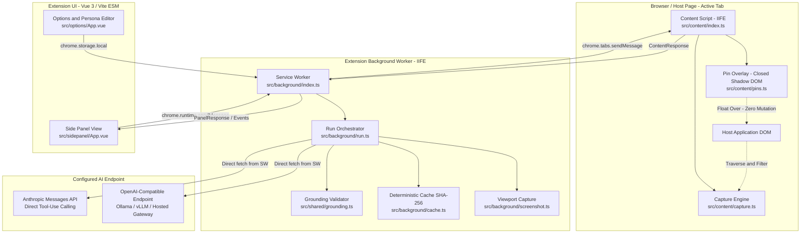
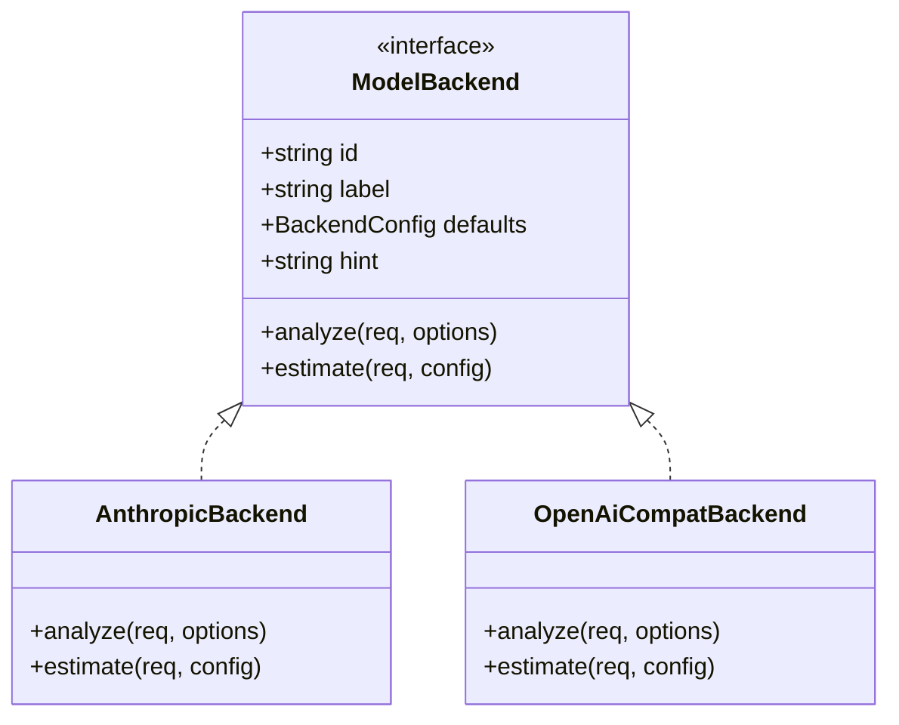
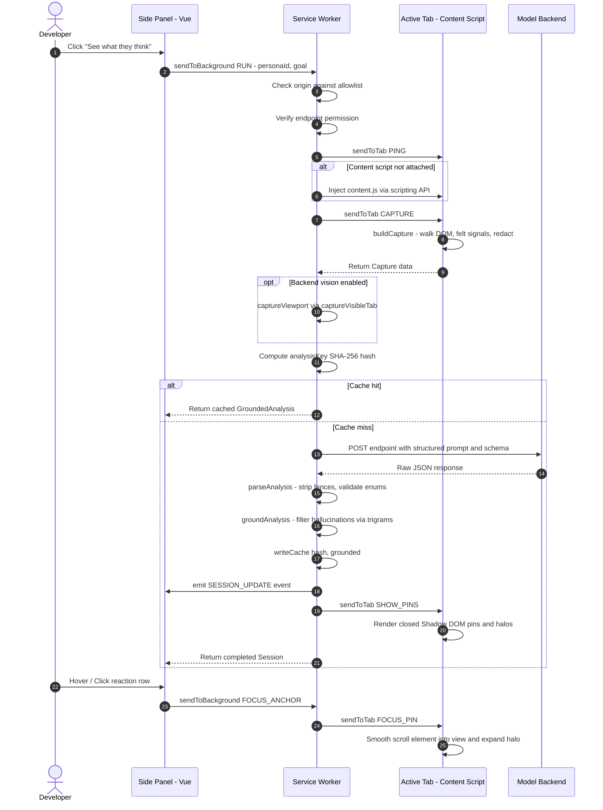

# Fresh Eyes — Technical Overview

Fresh Eyes is a browser extension (Manifest V3) that simulates how non-technical users perceive, navigate, and react to web applications. Unlike traditional accessibility linters or DOM validators that report technical rule violations (e.g., contrast ratios or missing ARIA labels), Fresh Eyes models human cognitive friction, emotional state, and task abandonment in real time.

---

## 1. Architectural Philosophy & Core Tenets

```
   Traditional Linters                 Fresh Eyes
┌──────────────────────────┐    ┌──────────────────────────┐
│ Contrast: 3.1:1          │    │ "I don't want to type my │
│ Missing input label      │    │  card before I know what │
│ Click target < 48px      │    │  this actually costs."   │
└──────────────────────────┘    └──────────────────────────┘
      Static Analysis               Cognitive Simulation
```

The system is governed by four strict design principles:

1. **Zero DOM Perturbation**: The extension inspects apps without altering their DOM or styles. No classes, attributes, or inline styles are injected into the host application. Element tracking uses `WeakMap` references and structural `nth-child` paths, while visual annotations live in an isolated closed `ShadowRoot`.
2. **Perceivable State over Raw DOM**: Raw HTML plumbing is stripped. Analysis operates exclusively on a reduced *perceivable page model* (1–3k tokens) representing what a human can see, read, and interact with, combined with runtime "felt signals" (layout shift, paint delays, runtime errors).
3. **Hard Grounding (Anti-Hallucination)**: LLMs prompted to simulate confused users frequently hallucinate non-existent interface elements (e.g., cookie banners or phantom buttons). Fresh Eyes drops any reaction that cannot be cross-referenced against verbatim page text or captured node identifiers using strict exact and fuzzy containment algorithms.
4. **Strict Least-Privilege & Zero Data Leakage**: The extension ships with zero ambient host permissions and no persistent content scripts. Form inputs (`<input value>`, `<textarea value>`) and passwords are never read. Rendered text is scrubbed of emails, tokens, API keys, and Luhn-validated credit card numbers before leaving the browser.

---

## 2. High-Level System Architecture

Fresh Eyes is built as a multi-context WebExtension targeting Chrome (MV3 with Side Panel API) and Firefox (MV3 with Sidebar Action).



### Component Context Separation

| Component | Bundle Target | Execution Context | Responsibilities |
|---|---|---|---|
| **Content Script** | `dist/content.js` (IIFE) | Host Web Page (Isolated World) | Extract perceivable nodes, measure runtime signals, render closed Shadow DOM pins. |
| **Service Worker** | `dist/background.js` (IIFE) | Extension Service Worker | Run lifecycle, origin allowlisting, permission elevation, LLM API dispatch, grounding, caching. |
| **Side Panel** | `dist/assets/sidepanel.js` (ESM) | Extension Page (`sidepanel/`) | Reaction timeline, cause filtering, anchor highlighting, persona selection, verdict badge. |
| **Options Page** | `dist/assets/options.js` (ESM) | Extension Page (`options/`) | Endpoint configuration, API key storage, custom persona editing, allowlist management. |

---

## 3. Subsystem Deep Dives

### 3.1 Perceivable Page Model & Capture Pipeline (`src/content/capture.ts`)

Instead of ingesting large DOM trees or screenshots alone, Fresh Eyes converts the visible page into an indented structural outline representing human perception.

```
Host DOM Tree
     │
     ▼
[Filter Non-Visual & Invisible Nodes] (script, style, opacity:0, aria-hidden, 0-rect)
     │
     ▼
[Extract Perceivable Node Data]
   ├── Tag & Inferred Semantic Role (button, link, heading, input...)
   ├── Accessible Name (aria-label, labelledby, native <label>, alt)
   ├── Own Text (excluding descendant duplication, clamped at 300 chars)
   ├── Style Metrics (computed font size, relative luminance contrast)
   ├── Layout Placement (bounding box, fold boundary: 'above' | 'below')
   └── State Flags (disabled, required, invalid, looksClickable)
     │
     ▼
[Redaction Engine] (Email regex, Credential patterns, Luhn-checked Credit Cards)
     │
     ▼
[Priority Budget Allocator] (Sort by Priority: interactive > heading > above-fold)
     │
     ▼
Candidate Nodes Capped at NODE_BUDGET (400) -> Yields ~1k–3k Tokens
```

#### Node Reduction & Prioritization
- **Target Node Budget (`NODE_BUDGET = 400`)**: If candidates exceed 400 nodes, elements are ranked by perceptual importance:
  ```text
  Priority = (interactive × 4) + (heading × 3) + (above_fold × 2) + (image × 1)
  ```
  Nodes surviving the budget are restored to natural document reading order to preserve narrative flow.
- **Accessible Name Resolution**: Follows ARIA labels, `aria-labelledby`, `<label for="...">`, wrapping `<label>`, or image `alt`, omitting placeholder fallbacks (which disappear on typing).
- **Dead Click Detection (`looksClickable`)**: Identifies elements with `cursor: pointer` that lack interactive semantics (`role`, `tabindex >= 0`, `<a>` with `href`, `<button>`). These represent deceptive dead click traps.

#### Felt Signals Collection
Non-visual signals that impact perceived usability are monitored at runtime:
- **Cumulative Layout Shift (CLS)**: Observed via `PerformanceObserver({ type: 'layout-shift', buffered: true })` excluding shifts caused by user interaction.
- **Paint Timings (FCP / LCP)**: Read synchronously from `performance.getEntriesByType('paint')` to avoid race conditions with on-demand script injection.
- **Uncaught Page Errors**: Tracked via passive `window.addEventListener('error')` and `unhandledrejection` listeners without mutating or monkey-patching `console.error`.
- **Text Characteristics**: Tracks `longestTextBlockChars` (uninterrupted prose walls), `smallestFontPx`, and `worstContrastRatio` (calculated via WCAG relative luminance formulas).

---

### 3.2 Zero-Footprint Visual Marker Overlay (`src/content/pins.ts`)

Fresh Eyes renders numeric pins and highlight halos over page elements corresponding to LLM reactions.

```
HTML Document
└── <div> id="fresh-eyes-overlay" (position: fixed; inset: 0; pointer-events: none; z-index: 2147483646)
    └── #shadow-root (closed)
        ├── <style> (.pin, .halo, .sev-1..5) </style>
        └── <div> (Marker Container Layer)
            ├── <div class="pin sev-4">3</div> (pointer-events: auto)
            └── <div class="halo sev-4"></div>
```

#### Critical Implementation Guarantees:
1. **Closed Shadow Root (`mode: 'closed'`)**: The host page cannot inspect `element.shadowRoot`, query into marker elements, or leak CSS styles into the overlay.
2. **No Host Node Alteration**: The inspected DOM elements receive zero classes, data attributes, or styles. References are held in an in-memory `WeakMap<Element, string>` and `Map<string, WeakRef<Element>>`.
3. **Resilience to Single-Page App Re-renders**: If a modern framework (React, Vue, Svelte) unmounts and replaces a DOM node, `resolveById()` falls back to an structural CSS path:
   ```ts
   // Example structural path: html > body:nth-child(2) > main:nth-child(1) > form:nth-child(2) > button:nth-child(3)
   document.querySelector(pathById.get(id))
   ```
4. **Positioning & Offset Rules**: Markers are positioned just outside the target element's left edge (`rect.left - PIN_SIZE / 2`), ensuring the numbered badge never obstructs the very text or label being criticized.

---

### 3.3 Persona Engine & Prompt Design (`src/shared/personas/`, `src/shared/prompt.ts`)

Simulations are driven by structured personas rather than loose demographic descriptions.

```ts
export interface Persona {
  id: string
  name: string
  context: string        // Real-world user framing
  techLevel: 1 | 2 | 3 | 4 | 5
  patience: 'low' | 'medium' | 'high'
  device: 'desktop' | 'mobile'
  motivation: string     // Determines friction absorption capacity
  quirks: string[]       // Behavioral rules ("Will not enter card before price")
  unknownWords: string[] // Jargon words that trigger confusion
  custom?: boolean
}
```

#### Shipped Defaults:
- **Margaret (68)**: Tech 1, medium patience, iPad/desktop. Reads every word literally, assumes mistakes are her fault, halts at jargon (`workspace`, `provision`, `tenant`).
- **Dani (26)**: Tech 3, low patience, one-handed mobile on transit. Skips text blocks >2 lines, abandons forms with >3 fields, baffled by developer terminology (`webhook`, `SSO`, `deploy`).
- **Ruth (44)**: Tech 2, high patience, desktop. Small business owner spending own money. High tolerance for complexity, zero tolerance for hidden pricing or vague cancellation terms.
- **Tomás (35)**: Tech 4, medium patience, desktop. Office manager phished in the past. Suspicious of invasive permissions, third-party trackers, and unclear data collection.

#### Device Viewport Gate
To avoid hallucinations, if a mobile persona (e.g., Dani) runs against a viewport exceeding 700px width, the background orchestrator throws an explicit error:
```
"Dani uses a phone, but this window is 1280px wide. Switch to a phone-sized viewport, or pick a persona who uses a desktop."
```

#### Compact Markdown Outline Representation
Rather than feeding raw JSON (where 35% of tokens are repeated keys and punctuation), `buildUserPrompt()` serializes the page as an indented outline:

```markdown
THE PERSON
Margaret, 68. Retired teacher...
Words they do not know the meaning of: dashboard, workspace, instance, API

WHAT THEY ARE TRYING TO DO
Sign up for an account

PAGE — "Create Workspace"
Screen is 1280×720. The page is 900 tall, so it all fits on one screen.

[fe-1] heading "Setup your workspace instance" (fontSize: 24px)
[fe-2] text "Configure multi-tenant provisioning options below." (fontSize: 14px, contrast: 4.5:1)
[fe-3] input "Workspace slug" (required, placeholder: "acme-corp")
[fe-4] button "Provision Now" (looksClickable: true)

HOW THE PAGE BEHAVED
- Cumulative layout shift was 0.28 (noticeable jumping)
- 1 element looks clickable but does not respond
```

---

### 3.4 Model Gateway & Backend Abstraction (`src/shared/backends/`)

All network calls are executed exclusively within the background service worker. The host page's Content Security Policy (CSP) never interferes with model requests, and the inspected application cannot observe outgoing analysis traffic.



1. **Anthropic Native API (`anthropic.ts`)**:
   - Uses Anthropic Messages API with header `anthropic-dangerous-direct-browser-access: true`.
   - Forces structured output via explicit tool calling (`report_reactions`). This mathematically eliminates conversational filler ("Here is the report...").
   - Transmits viewport screenshots as base64 JPEG attachments when vision is enabled.
2. **OpenAI-Compatible API (`openai-compat.ts`)**:
   - Supports Ollama (`http://localhost:11434/v1`), vLLM, LocalAI, and hosted gateways.
   - Conditionally sends `response_format: { type: 'json_schema', ... }` when supported, or falls back to robust markdown code fence extraction.
   - Omits `Authorization` header entirely when API key is empty to avoid local server rejections.

---

### 3.5 Contract Validation & Hard Grounding (`src/shared/grounding.ts`)

#### Closed Vocabularies
To enable comparative metrics across runs, outputs adhere to finite runtime enums:
- **`Feeling`**: `confused`, `annoyed`, `anxious`, `bored`, `reassured`, `delighted`
- **`UserAction`**: `reads_on`, `hesitates`, `rereads`, `scrolls_past`, `clicks_wrong_thing`, `opens_new_tab_to_search`, `switches_tab`, `closes_page`, `asks_someone_for_help`, `abandons_task`, `completes_step`
- **`Terminal Actions`**: `closes_page`, `abandons_task`, `switches_tab`
- **`Cause`**: `jargon`, `unclear_next_step`, `trust`, `cost_uncertainty`, `wall_of_text`, `slow`, `error`, `form_friction`, `lost_in_nav`, `visual_noise`, `cant_find_it`

#### Anti-Hallucination Pipeline

```
Model Output (AnalysisResult)
     │
     ▼
For each Reaction:
   1. Valid Sequence? Check for duplicate sequence numbers.
   2. Valid Anchor? Ensure anchorId matches captured node ID (or null for page-level).
   3. Non-Empty Evidence? Reject unreferenced opinions.
   4. Verbatim Text Check:
      ├── Exact Substring in Page Corpus? ──► [ACCEPT]
      └── Trigram Containment Score >= 0.8?
          ├── Yes ────────────────────────────► [ACCEPT]
          └── No ─────────────────────────────► [DISCARD]
     │
     ▼
Reconcile Verdict:
   If abandoned step was discarded, re-evaluate outcome based on surviving reactions.
     │
     ▼
GroundedAnalysis (with Discarded Reasons list)
```

**Trigram Containment Algorithm**:
```text
Containment(A, B) = |Trigrams(A) ∩ Trigrams(B)| / |Trigrams(A)|
```
Where `A` is the normalized quoted evidence and `B` is a corpus block from the page model. This allows minor whitespace variations or dropped trailing punctuation without permitting fabricated UI elements.

---

### 3.6 Deterministic Caching (`src/background/cache.ts`)

To avoid repeated token consumption and model non-determinism during UI development, analyses are cached using a 16-byte SHA-256 digest:

```text
CacheKey = SHA-256([nodes, personaId, persona, goal, backendId, model, hasScreenshot])
```

- Ephemeral variables (timestamps, scroll offsets) are excluded from the hash.
- Up to 20 LRU entries are retained in `chrome.storage.local`.

---

## 4. End-to-End Execution Sequence



---

## 5. Security & Privacy Model

```
┌─────────────────────────────────────────────────────────────────┐
│                    Chrome / Firefox Sandbox                     │
│                                                                 │
│   Host Web Page                                                 │
│   ┌─────────────────────────────────────────────────────────┐   │
│   │ • Typed input values: EXCLUDED                           │   │
│   │ • Password fields: EXCLUDED                             │   │
│   │ • Rendered text: REDACTED (Email, Tokens, Luhn Cards)   │   │
│   │ • Element Tracking: WeakMap (No DOM attribute leakage)  │   │
│   │ • Visual Pins: Closed Shadow DOM (Isolated CSS)         │   │
│   └─────────────────────────────────────────────────────────┘   │
│                               ▲                                 │
│                   activeTab (Ephemeral Grant)                   │
│                               ▼                                 │
│   Service Worker                                                │
│   ┌─────────────────────────────────────────────────────────┐   │
│   │ • Origin Allowlist Gate (Default: localhost only)       │   │
│   │ • Endpoint Reachability Check (explicit permissions)    │   │
│   │ • API Keys stored in chrome.storage.local (Never sync)  │   │
│   │ • Outgoing traffic bypasses Page CSP                    │   │
│   └─────────────────────────────────────────────────────────┘   │
└─────────────────────────────────────────────────────────────────┘
```

1. **Ephemeral Access Model**: Fresh Eyes declares no host permissions by default (`"optional_host_permissions": ["http://*/*", "https://*/*"]`). Script execution occurs under user-initiated `activeTab`. Permanent host access is opt-in per origin via the Settings panel.
2. **Origin Allowlist**: Every run is evaluated against `settings.allowedOrigins`. Staged code cannot accidentally transmit data from untrusted domains.
3. **Data Redaction Pipeline (`src/shared/redact.ts`)**:
   - Passwords and inputs are omitted at the DOM traversal stage.
   - Rendered page strings are scrubbed of emails, JWT tokens, GitHub personal access tokens, AWS keys, Slack tokens, private keys, and card-shaped digit sequences matching the Luhn checksum algorithm.
4. **Credential Isolation**: API keys reside solely in `chrome.storage.local`. They are never passed to `chrome.storage.sync` and are never exposed back to host pages.

---

## 6. Build & Packaging Architecture

The project requires three distinct Vite bundling passes due to conflicting platform constraints:

```
scripts/build.mjs
    ├── Pass 1: vite.config.ts
    │   ├── Entry: src/sidepanel/index.html ──► dist/sidepanel/ + assets/ (ESM)
    │   └── Entry: src/options/index.html   ──► dist/options/   + assets/ (ESM)
    │
    ├── Pass 2: vite.script.config.ts (FE_ENTRY=background)
    │   └── Entry: src/background/index.ts  ──► dist/background.js (IIFE)
    │
    ├── Pass 3: vite.script.config.ts (FE_ENTRY=content)
    │   └── Entry: src/content/index.ts     ──► dist/content.js (IIFE)
    │
    └── Manifest Processing
        ├── Chrome Target:  manifest.chrome.json  ──► dist/manifest.json (MV3 Service Worker)
        └── Firefox Target: manifest.firefox.json ──► dist/manifest.json (MV3 Classic Background)
```

- **Why Dual Configs?**: Side panel and Options views leverage standard ESM chunk splitting and Vue single-file components. Conversely, the Content Script and Service Worker must be strictly self-contained single-file IIFE bundles with zero external imports to function reliably across Chrome and Firefox extension runtimes.

---

## 7. Testing & Regression Strategy

The test suite (`tests/`) validates behavioral invariants using Vitest and JSDOM:

- `capture.test.ts`: Verifies node budget enforcement, role inference, accessible name resolution, and form state sanitization.
- `grounding.test.ts`: Tests exact and trigram fuzzy containment, hallucinated element rejection, and verdict reconciliation.
- `redact.test.ts`: Validates Luhn checksum verification and sensitive token mask replacement.
- `personas.test.ts` & `settings.test.ts`: Tests persona diffing and origin permission matching.

### Fixture-Based Evaluation Harness
Fresh Eyes includes two static benchmark pages in `fixtures/`:
1. `hostile.html`: Anti-pattern showcase featuring dead click traps, low-contrast text (1.7:1), 638-character wall of text, missing labels, and deceptive pricing. Expected outcome: `abandoned`.
2. `friendly.html`: High-usability counter-example with clear pricing, 6.2:1 contrast, explicit form labels, and compact copy. Expected outcome: `completed`.

Prompt or model modifications must consistently pass this fixture eval before acceptance.

---

## 8. Technical Specifications & Reference

### Directory Layout

```
fresh-eyes/
├── fixtures/                     # Regression testing pages (friendly & hostile)
├── scripts/
│   ├── build.mjs                 # Multi-pass build runner
│   └── make-icons.mjs            # Extension icon generation
├── src/
│   ├── background/
│   │   ├── cache.ts              # SHA-256 analysis cache
│   │   ├── index.ts              # Service worker messaging & script injection
│   │   ├── run.ts                # Orchestrator (capture -> model -> ground)
│   │   └── screenshot.ts         # Viewport capture helper
│   ├── content/
│   │   ├── capture.ts            # Perceivable page model & signal extraction
│   │   ├── index.ts              # Page-level message receiver
│   │   └── pins.ts               # Closed Shadow DOM marker overlay
│   ├── options/                  # Settings UI (Vue 3)
│   ├── shared/
│   │   ├── backends/             # Anthropic & OpenAI-compatible drivers
│   │   ├── personas/             # Shipped default personas and storage store
│   │   ├── grounding.ts          # Hallucination validation & containment
│   │   ├── messages.ts           # Type-safe cross-context protocol
│   │   ├── prompt.ts             # Markdown outline serialization & prompt
│   │   ├── redact.ts             # Regex + Luhn PII & secret redactor
│   │   ├── schema.ts             # JSON schema and resilient JSON parser
│   │   ├── settings.ts           # Storage schema & origin matchers
│   │   └── types.ts              # Core domain model & closed vocabularies
│   └── sidepanel/                # Interactive side panel UI (Vue 3)
├── tests/                        # Vitest unit test suite
├── manifest.chrome.json          # Chrome MV3 manifest
├── manifest.firefox.json         # Firefox MV3 manifest
├── vite.config.ts                # UI bundle configuration
└── vite.script.config.ts         # IIFE script bundle configuration
```

### Core Type Signatures

```ts
interface CapturedNode {
  id: string              // e.g. "fe-7"
  role: string            // Inferred ARIA role
  name: string            // Accessible name
  text: string            // Visible text (< 300 chars)
  tag: string
  box: { x: number; y: number; w: number; h: number }
  fold: 'above' | 'below'
  interactive: boolean
  state?: FormState
  style: { fontSizePx: number; contrastRatio?: number; looksClickable: boolean }
  path: string            // nth-child selector path
  parentId: string | null
}

interface Reaction {
  seq: number
  captureId: string
  anchorId: string | null
  quote: string           // First-person simulation voice
  feeling: Feeling
  action: UserAction
  cause: Cause
  severity: 1 | 2 | 3 | 4 | 5
  evidence: string        // Verbatim quoted page string
}

interface Verdict {
  outcome: 'completed' | 'completed_with_friction' | 'abandoned'
  abandonedAtSeq: number | null
  summary: string
  topFixes: { fix: string; addressesSeq: number[] }[]
  confidence: 'low' | 'medium' | 'high'
}
```
